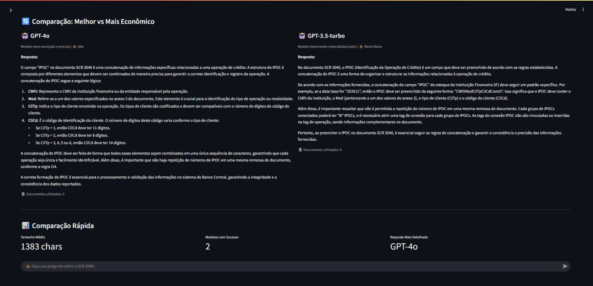
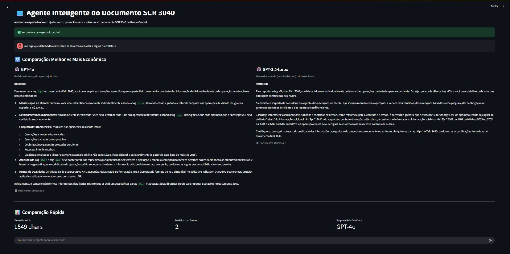
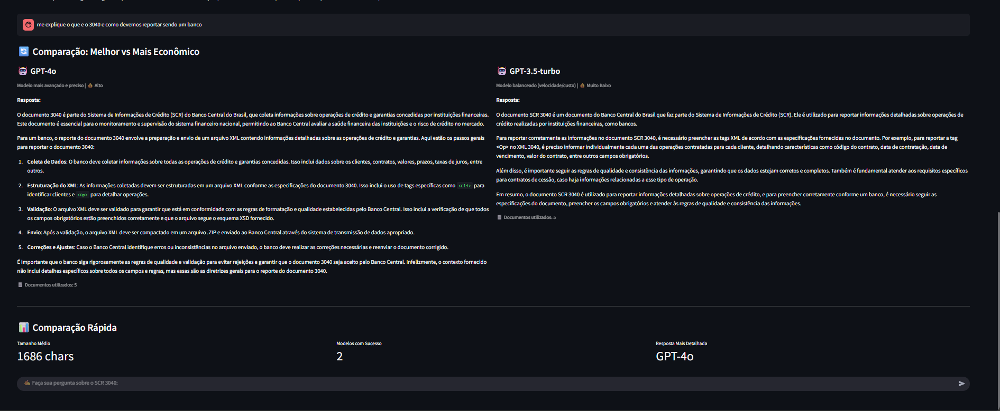
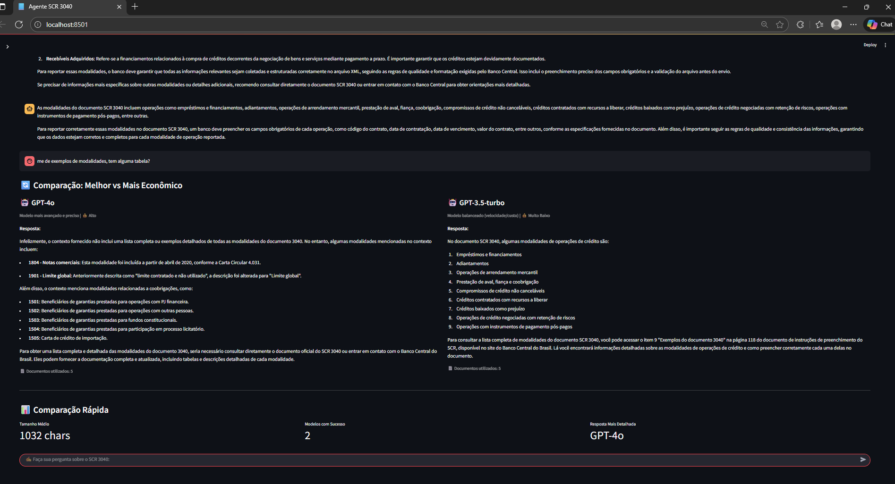

# Agente Inteligente para Suporte ao Preenchimento do Documento SCR 3040 do Banco Central do Brasil

#### Aluno: [Gabriel Diniz Perez Rocha](https://github.com/gdperezr)

#### Orientadora: [Evelyn].

---

Trabalho apresentado ao curso [BI MASTER](https://ica.puc-rio.ai/bi-master) como pré-requisito para conclusão de curso.

- [Link para o código](agente/app_melhorado.py)
- [Link para o código Github](https://github.com/gdperezr/regulatory_agent)

---

### Resumo

Este trabalho apresenta o desenvolvimento de um agente inteligente baseado em técnicas de Retrieval Augmented Generation (RAG) para auxiliar profissionais do setor financeiro no preenchimento e compreensão do documento SCR 3040 do Banco Central do Brasil. O sistema processa múltiplos formatos de documentos (PDF, XLS e XML), utilizando embeddings semânticos e modelos de linguagem de grande escala (LLM) para fornecer respostas precisas e contextualizadas sobre a estrutura, tags XML, atributos e regras de preenchimento do documento. A solução implementada utiliza a biblioteca LangChain para orquestração, FAISS para armazenamento vetorial eficiente, e foi testada com dois modelos da OpenAI (GPT-4o e GPT-3.5-turbo) com funcionalidade de comparação lado a lado para avaliação de desempenho. A interface web foi desenvolvida em Streamlit, proporcionando uma experiência de usuário intuitiva e acessível, com recursos de busca complementar na internet via DuckDuckGo. O sistema demonstra eficácia na recuperação de informações relevantes e na geração de respostas contextualizadas, contribuindo para a redução de erros no preenchimento de documentos regulatórios e para o aumento da produtividade dos profissionais envolvidos.

### Abstract

This work presents the development of an intelligent agent based on Retrieval Augmented Generation (RAG) techniques to assist financial sector professionals in filling out and understanding the SCR 3040 document from the Central Bank of Brazil. The system processes multiple document formats (PDF, XLS, and XML), using semantic embeddings and large language models (LLM) to provide accurate and contextualized answers about the document's structure, XML tags, attributes, and filling rules. The implemented solution uses the LangChain library for orchestration, FAISS for efficient vector storage, and was tested with two OpenAI language models (GPT-4o and GPT-3.5-turbo) with side-by-side comparison functionality for performance evaluation. The web interface was developed in Streamlit, providing an intuitive and accessible user experience, with complementary internet search capabilities via DuckDuckGo. The system demonstrates effectiveness in retrieving relevant information and generating contextualized responses, contributing to the reduction of errors in filling regulatory documents and increasing the productivity of involved professionals.

### 1. Introdução

O Sistema de Controle de Riscos (SCR) do Banco Central do Brasil exige que instituições financeiras enviem periodicamente documentos padronizados com informações detalhadas sobre suas operações. O documento SCR 3040, em particular, apresenta complexidade significativa devido à sua estrutura hierárquica em XML, múltiplos atributos obrigatórios e regras específicas de preenchimento. Profissionais do setor financeiro frequentemente enfrentam dificuldades para compreender a estrutura completa do documento, identificar os atributos corretos para cada tag XML e garantir a conformidade com as instruções do Banco Central.

Este trabalho propõe o desenvolvimento de um agente inteligente que utiliza técnicas de Processamento de Linguagem Natural (NLP) e Recuperação de Informação para auxiliar no preenchimento correto do documento SCR 3040. A solução baseia-se na arquitetura RAG (Retrieval Augmented Generation), que combina recuperação de informações relevantes de uma base de conhecimento com geração de respostas contextualizadas por modelos de linguagem de grande escala.

O agente processa três tipos de documentos: (1) PDF com instruções de preenchimento, (2) planilha XLS com o leiaute detalhado do documento, e (3) arquivo XML de exemplo contendo a estrutura completa com tags e atributos. Através de embeddings semânticos, o sistema cria uma representação vetorial dos documentos que permite busca eficiente por similaridade. Quando um usuário faz uma pergunta, o sistema recupera os trechos mais relevantes e utiliza um modelo de linguagem para gerar uma resposta precisa e contextualizada.

### 2. Modelagem

A arquitetura do sistema é baseada em RAG (Retrieval Augmented Generation), composta por três componentes principais: ingestão e processamento de documentos, armazenamento vetorial e recuperação de informações, e geração de respostas contextualizadas.

**2.1 Ingestão e Processamento de Documentos**

O sistema processa três tipos de documentos:
- **PDF**: Contém as instruções oficiais de preenchimento do Banco Central, extraídas utilizando PyPDFLoader do LangChain
- **XLS**: Planilha com o leiaute detalhado do documento, processada via UnstructuredExcelLoader
- **XML**: Arquivo de exemplo com a estrutura completa, processado através de parsing XML customizado que extrai tags, atributos e hierarquia

Os documentos são divididos em chunks de 1500 caracteres com overlap de 200 caracteres utilizando RecursiveCharacterTextSplitter, garantindo que informações importantes não sejam fragmentadas entre chunks.

**2.2 Armazenamento Vetorial e Recuperação**

Os chunks de texto são convertidos em embeddings utilizando OpenAIEmbeddings (text-embedding-ada-002) e armazenados em um índice FAISS (Facebook AI Similarity Search) para busca eficiente por similaridade. O sistema utiliza busca MMR (Maximum Marginal Relevance) com k=5 documentos relevantes, fetch_k=10 candidatos e lambda_mult=0.7, balanceando relevância e diversidade dos resultados recuperados.

**2.3 Geração de Respostas**

O sistema foi testado com dois modelos de linguagem da OpenAI, permitindo comparação direta de desempenho:
- **GPT-3.5-turbo**: Modelo balanceado entre velocidade e custo, adequado para consultas simples
- **GPT-4o**: Modelo mais avançado e preciso, com melhor compreensão de contexto complexo

Ambos os modelos são configurados com temperatura de 0.1 para respostas mais determinísticas e precisas em contexto técnico. O sistema implementa ConversationalRetrievalChain do LangChain, que mantém histórico de conversação através de ConversationBufferMemory, permitindo que o agente compreenda o contexto de perguntas anteriores e forneça respostas mais coerentes. A interface permite comparação lado a lado entre os modelos, facilitando a avaliação de desempenho, qualidade das respostas e custo-benefício.

**2.4 Interface do Usuário**

A interface web foi desenvolvida em Streamlit, proporcionando:
- Chat interativo com histórico de conversação
- Seleção de modelo de linguagem (GPT-4o e GPT-3.5-turbo)
- Modo de comparação lado a lado entre modelos para avaliação de desempenho
- Processamento assíncrono com indicadores de carregamento
- Cache inteligente do vectorstore para melhor performance
- Busca complementar na internet via DuckDuckGo para informações adicionais
- Opções para limpar histórico e recriar o índice vetorial
- Métricas de comparação entre modelos (tamanho de resposta, sucesso, etc.)

### 3. Resultados

O sistema foi implementado e testado com sucesso, demonstrando capacidade de:

1. **Processamento Multi-formato**: O agente processa eficientemente documentos em PDF, XLS e XML, extraindo informações estruturadas e não estruturadas.

2. **Recuperação Semântica**: A busca por similaridade utilizando embeddings permite encontrar informações relevantes mesmo quando o usuário utiliza termos diferentes dos presentes nos documentos originais.

3. **Respostas Contextualizadas**: O modelo de linguagem gera respostas precisas baseadas no contexto recuperado, mantendo coerência com o histórico da conversação.

4. **Interface Intuitiva**: A interface Streamlit proporciona experiência de usuário fluida, com feedback visual adequado durante o processamento.

5. **Performance**: O cache do vectorstore e a otimização da busca MMR garantem tempos de resposta adequados mesmo com grandes volumes de documentos.

O sistema foi validado através de perguntas sobre estrutura XML, atributos obrigatórios, regras de preenchimento e exemplos práticos, demonstrando capacidade de fornecer informações precisas e úteis para profissionais do setor financeiro.

### Exemplos de uso do agente SCR 3040

#### Interface principal

#### Perguntas ao Agente a respeito do tema 3040
**Exemplo 1: Pergunta sobre IPOC**

**Exemplo 2: Pergunta sobre tag OP**

**Exemplo 3: Explicação detalhada do SCR 3040**

**Exemplo 4: Pergunta sobre modalidades**

### 4. Conclusões

Este trabalho apresentou o desenvolvimento de um agente inteligente baseado em RAG para suporte ao preenchimento do documento SCR 3040 do Banco Central do Brasil. A solução demonstra a viabilidade de utilizar técnicas de NLP e recuperação de informação para auxiliar profissionais em tarefas complexas de conformidade regulatória.

Os principais contributos deste trabalho incluem: (1) processamento integrado de múltiplos formatos de documentos (PDF, XLS, XML), (2) implementação eficiente de RAG utilizando tecnologias state-of-the-art, (3) interface web acessível e intuitiva com suporte a dois modelos (GPT-4o e GPT-3.5-turbo), (4) funcionalidade de comparação entre modelos para avaliação de desempenho e custo-benefício, e (5) validação prática da solução com documentos reais do Banco Central, incluindo análise comparativa dos modelos testados.

#### 4.1 Comparação de Modelos

Durante o desenvolvimento e testes do sistema, foram avaliados dois modelos de linguagem da OpenAI, permitindo uma comparação direta de desempenho, custo e qualidade das respostas:

| Modelo | Velocidade | Custo | Precisão | Qualidade das Respostas | Uso Recomendado |
|-------|-----------|-------|----------|------------------------|-----------------|
| **GPT-3.5-turbo** | ⭐⭐⭐⭐ | ⭐⭐⭐⭐⭐ | ⭐⭐⭐ | ⭐⭐⭐ | Consultas simples, orçamento limitado |
| **GPT-4o** | ⭐⭐⭐ | ⭐⭐ | ⭐⭐⭐⭐⭐ | ⭐⭐⭐⭐⭐ | Consultas complexas, máxima precisão |

**Principais Observações:**

1. **GPT-3.5-turbo**: 
   - Demonstrou bom desempenho em consultas diretas e objetivas sobre o SCR 3040
   - Respostas mais rápidas e com custo significativamente menor
   - Ocasionalmente perdeu nuances em perguntas mais complexas sobre estrutura XML, atributos e regras de validação inter-relacionadas
   - Respostas mais concisas, às vezes menos detalhadas para casos de uso complexos
   - Ideal para desenvolvimento, testes iniciais e consultas de rotina com orçamento limitado

2. **GPT-4o**: 
   - Mostrou superioridade clara em compreensão de contexto complexo e geração de respostas mais detalhadas e precisas
   - Particularmente eficaz em perguntas que requerem análise de múltiplos atributos XML, hierarquia de tags e regras de negócio inter-relacionadas
   - Melhor capacidade de síntese de informações de múltiplos documentos (PDF, XLS, XML)
   - Respostas mais completas e contextualizadas, com melhor explicação de conceitos técnicos
   - Maior capacidade de inferência e conexão entre diferentes partes do documento SCR 3040
   - Custo mais elevado, mas justificado para consultas críticas que exigem máxima precisão

**Recomendação Final:**

Com base nos testes realizados, recomenda-se o uso do **GPT-4o** para consultas sobre o documento SCR 3040, especialmente considerando a complexidade técnica e a necessidade de precisão em documentos regulatórios. O modelo demonstrou capacidade superior em:
- Compreender e explicar a estrutura hierárquica XML do documento
- Conectar informações de diferentes fontes (instruções PDF, leiaute XLS e exemplo XML)
- Fornecer respostas mais completas e contextualizadas sobre regras de preenchimento
- Analisar relações entre atributos obrigatórios e validações

O **GPT-3.5-turbo** pode ser utilizado como alternativa mais econômica para consultas simples e diretas, mas com limitações em casos que exigem análise profunda ou compreensão de contexto complexo.

A funcionalidade de comparação lado a lado implementada na interface permitiu avaliar empiricamente as diferenças entre os modelos, facilitando a tomada de decisão baseada em dados reais e demonstrando claramente a superioridade do GPT-4o para este caso de uso específico.

---

Matrícula: [231100995]

Pontifícia Universidade Católica do Rio de Janeiro

Curso de Pós Graduação *Business Intelligence Master*

